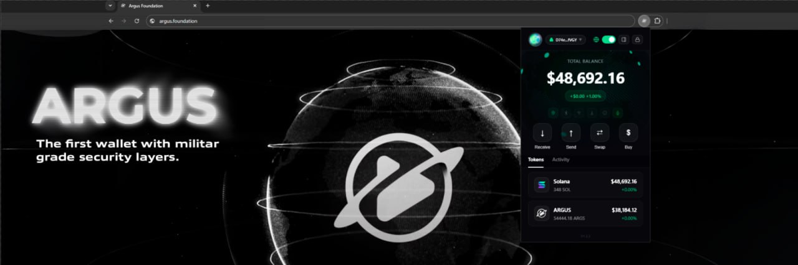

# Argus Docs

Documentation for Argus, built on top of [Docusaurus 2](https://docusaurus.io/). This site explains how Argus secures wallets, how to deploy and operate Argus Vault, and how to integrate it in your stack.

## What you will find here
- Core concepts behind Argus Vault and the dual-wallet model
- Security architecture and geo-vault protections
- Getting-started guides for installation, setup, and web browsing
- Deployment walkthroughs and code examples
- Ecosystem notes, roadmap, and FAQ

## Tech stack
- Static site: Docusaurus 2 (React + MDX)
- Styling: CSS modules with a light customization layer
- Content: Markdown/MDX stored under `docs` and `blog`

## Getting started
Prerequisites: Node.js LTS and `yarn` installed.

```bash
yarn        # install dependencies
yarn start  # run dev server at http://localhost:3000
```

## Build & deploy
```bash
yarn build                 # generate static site into /build
USE_SSH=true yarn deploy   # deploy with SSH
# or
GIT_USER=<github-username> yarn deploy
```

## Project layout
- `docs/` main documentation content (concepts, guides, roadmap)
- `blog/` news and updates
- `src/` UI components and pages
- `static/` images, video, and other static assets
- `docusaurus.config.js` site configuration
- `sidebars.js` navigation and doc ordering

## Contributing
- Keep content in Markdown/MDX and prefer concise sections with links for depth.
- Add new docs under `docs/` and update `sidebars.js` to expose them in navigation.
- Run `yarn start` locally to preview changes before opening a PR.

## Credits
- Built with ❤️ on [Docusaurus](https://docusaurus.io/) and the open-source ecosystem around it.
- Argus brand assets and banner are provided by the Argus team.
